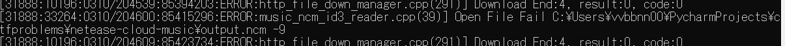

# NcmCrypt

一个用于将普通音频文件加密为网易云音乐专用格式（.ncm）的工具。

> 注意：该工具不是用于破解网易云音乐加密文件的，代码仅供学习交流使用，不得用于任何商业用途，否则后果自负。

## 鲜有人涉足的领域

解密网易云音乐的`.ncm`文件的工具比比皆是，但几乎没有人开发过将普通音频文件加密为
`.ncm`格式的工具。

这个看似无用，实际也很无用的领域引起了我的好奇心，于是便有了这个项目。

## 如何使用

首先，克隆本项目并安装依赖：

```bash
git clone https://github.com/vvbbnn00/NcmCrypt.git
cd NcmCrypt
pip install -r requirements.txt
```

然后，运行`cli.py`脚本：

```bash
python cli.py [-h] --file_path FILE_PATH --img_path IMG_PATH --meta_path META_PATH [--key_data KEY_DATA] [--output OUTPUT] [--debug]
```

以下是一个例子，他将[./test/little_explorer.mp3](./test/little_explorer.mp3)
加密为[./test/little_explorer.ncm](./test/little_explorer.ncm)：

```bash
python cli.py --file_path ./test/little_explorer.mp3 --img_path ./test/cover.jpg --meta_path ./test/meta.json --output ./test/little_explorer.ncm
```

### 参数说明

- `--file_path`：原音频文件路径
- `--img_path`：专辑封面图片路径
- `--meta_path`：音乐元数据信息路径
- `--key_data`（可选）：自定义加密密钥
- `--output`（可选）：输出`.ncm`文件的路径
- `--debug`（可选）：打开调试模式，查看详细加密过程
- `-h`：显示帮助

## 实现过程

### 从解密到加密：意料之外的复杂性

起初，我认为这会是一个简单的过程：只需要理解解密算法，然后反向实施它即可。

于是我开始研究各种流行的`.ncm`解密脚本，很快就掌握了基本文件结构：


但当我尝试实现加密功能时，立刻遇到了一个棘手的问题。在广为流传的`.ncm`文件结构图中，
`meta`数据下方有一个标记为`5 bytes gap`和`4 bytes image cover crc`
的区域。大多数解密脚本直接跳过了这些字段，因为它们对解密过程不重要。

然而，当我尝试加密时，我发现网易云音乐客户端会严格检查这些字段。
如果它们不符合要求，客户端就会拒绝播放文件，并返回错误代码`-9`。



### 瞪眼法：由题不易得，难以注意到

这个问题困扰了我很久。两年前，我曾因此放弃了这个项目，同时在吾爱破解论坛发帖求助：[https://www.52pojie.cn/thread-1774779-1-1.html](https://www.52pojie.cn/thread-1774779-1-1.html)
，不过很可惜，没有人回复。

最近整理代码时，我重新发现了这个尘封的问题，决定再次挑战它。

首先尝试通过"瞪眼法"，即比较不同`.ncm`文件中这些神秘字段的模式。我截取了3首不同曲目中的这9个字节，并排列比较：

```
c45ed0de0146400600
c0b5a46101e8670900
1a34f1b7012b940900
```

通过仔细观察，我发现了一些规律：第5字节总是`01`，最后一字节总是`00`。这暗示着`01`
可能是某种分隔符，而`00`是某种结束符。前4字节看起来像某种校验值，而非简单的"gap"。
经过验证，我排除了它们是封面图片或音乐文件的CRC32校验值的可能性。

这样看来，格式似乎变成了：

```
[4 bytes unknown] 01 [3 bytes unknown] 00
```

但仅靠肉眼观察，我已经无法深入了。是时候采取更专业的手段了。

### 逆向工程：与ChatGPT一起解谜

既然"瞪眼法"已到极限，我决定尝试反汇编分析。
虽然我的逆向工程技能有限，但有ChatGPT的协助，我有信心能够突破。

我的切入点是客户端的错误信息格式：`Open File Fail [file_path] -[error_code]`。
我反汇编了`cloudmusic.dll`，搜索"Open File Fail"字符串，很快找到了相关代码：


经过一系列交叉引用查找，我发现了处理`.ncm`文件的关键类：
`&cloudmusic::NCMFileImpl`。
在其虚函数表中，我终于找到了返回错误码`-9`的函数：
`int __thiscall sub_10158660(int this)`


分析代码可知，返回`-9`的条件是两个变量`v20`和`v22`不相等：


进一步分析显示，`v22`被传入了疑似CRC32的校验函数，而被校验的内容似乎是文件头和加密密钥信息：


我大胆假设，9字节中，前4字节可能是对文件头和密钥信息的CRC32校验值。
尝试后证实了这一猜测——当我将前4字节设置为正确的CRC32值，错误代码从
`-9`变成了`-22`，说明第一关已经通过。

### 最后的谜题：神秘的4字节

接下来我分析了`-22`错误的触发条件，发现它在变量`v9`小于`v16`时发生：


ChatGPT在分析这段代码后，评价道：`v15`可能表示某个数据块的总大小，而
`v16`表示后续需要的数据大小。如果剩余大小不足，就会返回`-22`错误。

这让我重新思考了先前的分析。我原本将后4字节视为"3字节+`00`"，
但这样划分很不自然，因为3字节不符合常见的二进制存储类型。
如果将4字节作为一个整体，它可能代表某个uint32整数。

带着这个想法，我将这4字节作为uint32整数打印出来，惊讶地发现它与后面图片长度的4字节完全相同。
也就是说，图片长度被重复存储了2次。

说实话到这一步时有点无语，如果我早些查看文件的后续部分，就能更早发现这个线索。

### 揭开谜底：完整的文件结构

至此，那9个神秘字节的真实格式终于水落石出：

```
[4 bytes CRC32] 01 [4 bytes image length]
```

基于我的发现，修正后的完整`.ncm`文件结构如下：

```
+-----------------------------------------------+
|                NCM FILE STRUCTURE             |
+-----------------------------------------------+
| 8 bytes     | Magic Header: "CTENFDAM"        | <- Start of Header Body
+-------------+---------------------------------|
| 2 bytes     | Fixed Gap: "\x01p"              |
+-------------+---------------------------------|
| Variable    | AES-128 Key Information         |
+-------------+---------------------------------|
| 4 bytes     | Metadata Length                 |
+-------------+---------------------------------|
| Variable    | Metadata in JSON Format         | <- End of Header Body
+-------------+---------------------------------|
| 4 bytes     | CRC32 Checksum of Header Body   |
+-------------+---------------------------------|
| 1 byte      | Separator: "\x01"               |
+-------------+---------------------------------|
| 4 bytes     | Cover Image Length              |
+-------------+---------------------------------|
| 4 bytes     | Cover Image Length (duplicate)  |
+-------------+---------------------------------|
| Variable    | Cover Image Data                |
+-------------+---------------------------------|
| Variable    | Encrypted Music Data            |
+-----------------------------------------------+
```

## 致谢

本次的探索其实只是站在诸多前辈肩膀上的一次小小前进。非常感谢前人对`.ncm`
文件格式的深度探索与分析，正是这些宝贵的资料，才让我得以拨云见日。

特别鸣谢：

- [anonymous5l/ncmdump](https://github.com/anonymous5l/ncmdump)
- [taurusxin/ncmdump](https://github.com/taurusxin/ncmdump)
- [QCloudHao/ncmdump](https://github.com/QCloudHao/ncmdump)
- ChatGPT
- ...以及更多

探索的路上，每一个小发现都值得我们欣喜若狂，也希望我的这次经历能为后来者带来一点小小的启发与乐趣。

